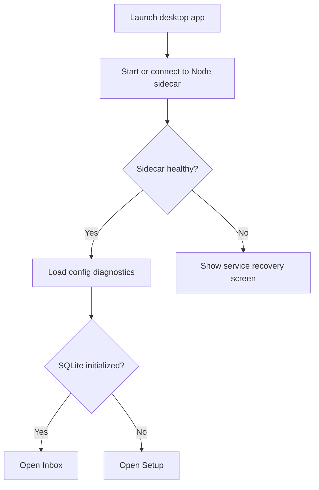

# Desktop Client UX Spec

## Design Principles

- Start with the workbench, not a landing page.
- Optimize for repeated scanning, triage, and recovery.
- Keep the interface quiet and dense enough for technical reading.
- Use SQLite business state as the primary UI state.
- Show integration failures as recoverable projection issues, not as data loss.
- Prefer explicit controls over hidden magic for destructive or expensive actions.

## App Shell

The app uses a two-pane operational shell:

- Left sidebar: navigation and global status.
- Main region: current page.
- Optional right detail pane on wide screens for article preview.

Primary navigation:

- Inbox
- Sources
- Jobs
- Logs
- Settings

Global status indicators:

- Sidecar health
- Active job count
- Failed job count
- Notion outbox failed count when Notion sync is enabled

## Startup Flow

### Service Recovery Screen

Show when the sidecar cannot be started or reached.

Actions:

- Retry connection
- View startup error
- Open logs when available
- Copy diagnostics

### Setup Screen

Use only when the local app is not initialized.

Sections:

- SQLite path
- LLM configuration readiness
- Notion integration setup
- Initial source configuration hint

Primary actions:

- Run setup
- Open Settings

## Inbox

### Layout

Desktop wide layout:

- Left filter rail inside main content
- Center article list
- Right article preview/detail pane

Narrow layout:

- Filters collapse into a toolbar menu
- Article detail opens as a full page

### Article List Row

Each row should show:

- Title
- Source
- Published time
- Status chip
- Summary status chip
- Extraction status chip only when not successful
- Small action icons for read/archive on hover or row focus

Rows should be stable in height so status text does not shift layout.

### Filters

Controls:

- Status segmented control: Unread, Read, Archived, All
- Summary status menu: All, Pending, Running, Done, Failed
- Source menu
- Search input
- Sort menu

Default view:

- Status: Unread
- Sort: Published newest first

### Empty States

- No unread articles: show a compact state with actions to fetch now or view all.
- No articles at all: show actions to add source or sync sources.
- Filter returns no results: show clear filters action.

### Error States

- API unavailable: show service recovery action.
- Articles request failed: show retry and error details.

## Article Detail

### Header

Show:

- Title
- Source
- Published time
- Original URL
- Status

Actions:

- Open original
- Mark read
- Archive
- Re-summarize

### Summary Section

Show formatted markdown from SQLite.

Metadata line:

- Summary skill
- Skill version
- Model
- Summarized time

If summary is missing:

- Pending: show waiting state and summarize action.
- Failed: show failure reason and retry action.
- Running: show active job hint.

### Content Section

Tabs:

- Summary
- Feed Excerpt
- Extracted Text
- Metadata

Default tab:

- Summary when available
- Feed Excerpt when summary is missing

The Extracted Text tab may be plain text and should preserve readable spacing.

## Sources

### Layout

Use a table-like list rather than cards.

Columns:

- Enabled
- Name
- URL
- Category
- Summary skill
- Last checked
- Last error
- Article count

Actions:

- Add source
- Edit source
- Disable or enable
- Sync from `sources.yaml`
- Fetch now

### Add/Edit Source Dialog

Fields:

- Name
- URL
- Enabled
- Category
- Summary skill

Validation:

- URL is required.
- URL must be valid HTTP or HTTPS.
- Name can default from feed metadata later, but first version should require it or infer from URL.

## Jobs

### Layout

Table with filters.

Columns:

- Status
- Type
- Trigger
- Created at
- Duration
- Error preview

Actions:

- Run fetch
- Run summarize
- Run archive
- Run sync-notion
- Open job detail

### Job Detail

Show:

- Full job payload/result when available
- Full error
- Parent job link
- Child jobs when available

## Logs

### Layout

Dense log viewer.

Controls:

- Tail on/off
- Level filter
- Search
- Copy visible lines

Rows:

- Timestamp
- Level
- Message
- Details expandable inline

## Settings

### Sections

Sidecar:

- Host
- Port
- Auth enabled
- PID
- Log path

Storage:

- SQLite path
- Database health

Fetching:

- Fetch cron
- Request timeout
- User agent

Summary:

- LLM key readiness
- Base URL
- Model
- Classifier model
- Poll interval
- Skills directory

Notion:

- Sync enabled
- Token readiness
- Parent page id
- Data source ids
- Outbox pending/failed counts
- Sync now action

### Editing Rules

- Do not expose secrets directly after they are saved.
- Allow replacing secrets.
- Warn before changing SQLite path.
- Runtime config changes that require sidecar restart should say so clearly.

## Interaction Details

### Mutations

For user-triggered mutations:

1. Optimistically update only when rollback is easy.
2. Otherwise show loading state on the specific control.
3. Refresh the affected query after success.
4. Show integration errors as warnings if SQLite update succeeded.

Example: marking an article as read may return `integrationErrors`. The UI should show the article as read and display a Notion sync warning with a `sync-notion` action.

### Background Updates

Use polling in the first version:

- Jobs: every 3 to 5 seconds when Jobs page is open.
- Inbox: refresh after relevant job completion.
- Global status: every 10 to 15 seconds.

WebSocket or server-sent events can be added later.

### Keyboard Shortcuts

First version can support:

- `j` / `k`: next or previous article in list
- `r`: mark read
- `a`: archive
- `/`: focus search
- `o`: open original

Shortcuts should not be required for core flows.

## Visual Direction

- Use a restrained operational palette, not a marketing hero layout.
- Keep typography compact and readable.
- Use icons for repeated actions such as refresh, archive, open, retry, settings.
- Avoid decorative cards inside cards.
- Tables and lists should use stable row heights.
- Long titles and URLs should truncate gracefully.

## Accessibility

- All icon buttons need accessible labels and tooltips.
- Keyboard navigation should work for the article list and primary actions.
- Status chips should not rely on color alone.
- Error messages should be text-visible and copyable.

## UX Acceptance Checklist

- App opens to useful data or a recoverable setup/service state.
- Inbox can be used comfortably without opening Settings.
- A failed Notion projection never makes an article look lost.
- Empty, loading, and error states exist for every page.
- Main actions are available through visible controls, not only shortcuts.
- Layout remains usable at laptop widths.

